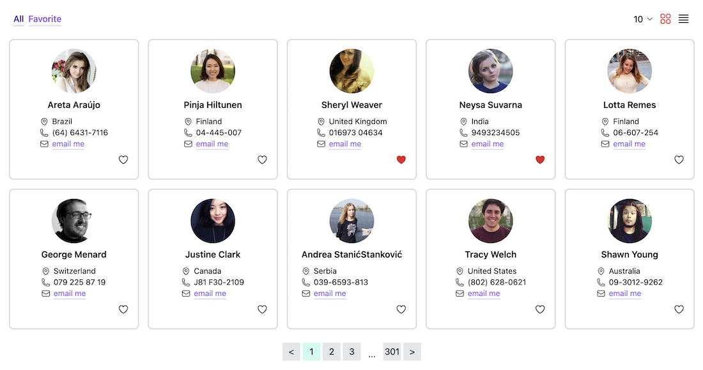

# Random User (Contact card) Application

## 📚 Overview

The Contact Card Application is a user-friendly web tool designed for efficient contact management and viewing. It is developed using Vite and the Vue Composition API, ensuring a modern and responsive user interface. To see the application in action, you can explore the [live demo](https://front-random-user.netlify.app/).



## ✨ Features

- 🕹️ **Flexible View Modes**: Easily switch between different view modes, adjust the number of contacts displayed per page, and access detailed contact information in a modal by clicking on a card.
- 💌 **Mark Favorites**: Easily mark your favorite contacts for quick and convenient access. Keep your most important connections at your fingertips.
- ⚙️ **Persistent User Settings**: Enjoy a consistent user experience every time you use the app. Your preferences and settings are saved, so you don't have to start from scratch each time.
- 🍍 State management using [**Pinia**](https://pinia.vuejs.org/).
- 📱 Sleek responsive design with [**Tailwind CSS**](https://tailwindcss.com/).
- 🐶 Simplify HTML syntax with **Pug**.

## 🛠️ Project Setup

1. Clone the repository: `git clone https://github.com/maychang7331/random-user.git`
2. Install dependencies: `npm install` (See "Start from scratch" for environment setup from scratch.)
3. Compile and run the application: `npm run dev`
4. For production build: `npm run build`
5. Preview the build locally: `npm run preview`

## 🚀 Deploy

This application is deployed using [Netlify](https://www.netlify.com/) with the following steps:

1. Add new site, select Deploy manually
2. Create a file named `netlify.toml` in the dist folder and the root folder with following content:
   ```
   [[redirects]]
   from = "/*"
   to = "/index.html"
   status = 200
   ```
3. Drag and drop the "dist" folder for deployment

## 🔨 Setup Environment From Scratch

If you want to set up your environment from scratch, follow these steps:

1. [Install Tailwind CSS with Vite using Vue](https://tailwindcss.com/docs/guides/vite#vue)
2. Install [prettier-plugin-tailwindcss](https://github.com/tailwindlabs/prettier-plugin-tailwindcss) and rename the file extension to `prettier.config.cjs` for sorting Tailwind classes automatically.
3. Install pug ([reference](https://medium.com/itsems-frontend/adding-pug-sass-to-your-project-a77668123f6b)): `npm i vue-cli-plugin-pug`
4. Install [@vue/language-plugin-pug](https://www.npmjs.com/package/@vue/language-plugin-pug): `npm install -D @vue/language-plugin-pug` and configure "jsconfig.json" (for resolving "import XXX.vue file but not used" issues in VSCode)
5. Install Pinia: `npm install pinia`
6. Install axios for fetching API: `npm install axios`

## 🔦 Problem Solving

1. Mis-use reactive to declare state properties in Pinia.

   ##### Problem Reproduction

   ```js
      // UserStore.js
      import { reactive } from 'vue';
      import { defineStore } from 'pinia';
      import axios from 'axios';

      export const useUserStore = defineStore('userStore', () => {
      const state = reactive({
         users: [],
         favorites: [],
         currentPage: 1,
         itemsPerPage: 10,
      });
   ```

   ```js
      // Home.vue
   	const userStore = useUserStore();
   	const { state } = storeToRefs(userStore);
   	const tabName = ref('all');
   	const data = computed(() => {
   	switch (tabName.value) {
   		case 'all':
   			return state.all;
   		case 'favorites':
   			return state.favorites;
   		default:
   			return state.all;
     }
   });

      console.log(state);            // ObjectRefImpl
      console.log(state.all);        // undefined
      console.log(state.value.all);  // Proxy(Array)
      console.log(data);             // ComputedRefImpl

      <template lang="pug">
      p {{state}}            // { "all": [], "favorites": [] }
      p {{state.all}}        // []
      p {{state.value.all}}  // NOTHING RENDERED
      p {{data}}             // NOTHING RENDERED
      </template>
   ```

   ##### Note

   - `ref` : returns RefImpl, need `.value` to access value
   - `reactive` : returns Proxy, NO need `.value` to access value
     But why do we need `.value` to access data when using reactive inside a pinia? Is it possible that we use reactive to declare state properties? Since no example can be found, and also said in the documentation that `ref` is used to declare the state properties, I decide NOT to use reactive in pinia store.

2. ModalOpen being triggered by clicking the like button and email link ☞ sol: check the element of which the event is originated using `e.target.tagName` together with Guard clause

3. Why does the favorites and pagination fails to persist between re-fresh if the `init` function is written in the `onMount` of `Home.vue` ⨯ NOT yet figured out
4. Modal closing isn't smooth, i.e., the transtion seems to be only apply when modal open. ☞ sol: [Issue#436](https://github.com/saadeghi/daisyui/issues/436)
